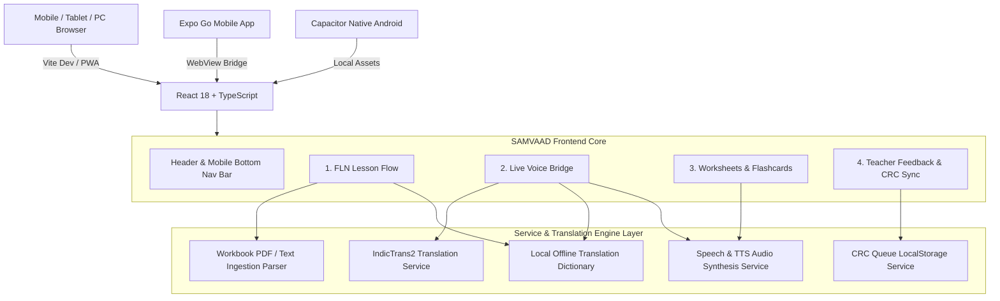

# 🇮🇳 SAMVAAD (संवाद | ᱥᱟᱱᱛᱟᱲᱤ) — Comprehensive Project & Teammate Onboarding Guide

> **Smart India Hackathon 2026** — Problem Statement ID: **SIH26042 (Smart Education)**  
> **Repository**: SAMVAAD Bilingual FLN Classroom Pedagogy Companion  
> **Target Region / Demographic**: Dumka District, Jharkhand (UDISE: `20040105602`) & Santhal Pargana  
> **Linguistic Pair**: Hindi (`hin_Deva`) ⟷ Santali (`sat_Olck` in authentic Ol Chiki Unicode script U+1C50–U+1C7F)  
> **Target Beneficiaries**: Grade 1–2 FLN (Foundational Literacy & Numeracy) Students & Non-Santali Speaking Government Teachers aligned with **NIPUN Bharat Guidelines**.

---

## 📑 Table of Contents
1. [Executive Summary & Problem Context](#1-executive-summary--problem-context)
2. [Pedagogical & Linguistic Foundation](#2-pedagogical--linguistic-foundation)
3. [System Architecture & Tech Stack](#3-system-architecture--tech-stack)
4. [Deep-Dive: Core Application Modules](#4-deep-dive-core-application-modules)
   - [Module 1: FLN Lesson Flow (पाठ योजना) & Workbook Ingestion](#module-1-fln-lesson-flow-पाठ-योजना--workbook-ingestion)
   - [Module 2: Live Voice Bridge (प्रत्यक्ष संवाद) & Audio Engine](#module-2-live-voice-bridge-प्रत्यक्ष-संवाद--audio-engine)
   - [Module 3: Classroom Worksheets & Flashcard Deck (Vice-Versa)](#module-3-classroom-worksheets--flashcard-deck-vice-versa)
   - [Module 4: Teacher Feedback & CRC Sync Queue](#module-4-teacher-feedback--crc-sync-queue)
5. [Directory & File Structure](#5-directory--file-structure)
6. [Local Setup, Development & Mobile Testing Workflow](#6-local-setup-development--mobile-testing-workflow)
7. [API & Data Specifications](#7-api--data-specifications)
8. [Teammate Onboarding Checklist & Ongoing Tasks](#8-teammate-onboarding-checklist--ongoing-tasks)

---

## 1. Executive Summary & Problem Context

### The Core Problem
In tribal belts such as Dumka and Santhal Pargana (Jharkhand), primary school children enter Grade 1 speaking **Santali** (their mother tongue). However, government school teachers primarily communicate in **Hindi**, and standardized textbooks (such as JCERT *Palash*) are printed in Hindi/Devanagari. 

This linguistic disconnect creates an immediate barrier during the critical Grade 1–2 FLN foundational period, leading to:
- Comprehension breakdown during daily classroom instructions.
- Low student engagement and early dropout rates.
- Teacher frustration due to lack of bilingual classroom pedagogy aids.

### The SAMVAAD Solution
**SAMVAAD** (संवाद) is an offline-first, dual-screen bilingual pedagogy companion engineered for rural government school classrooms. It operates simultaneously as:
1. A **structured 5-beat lesson translator** mapping Hindi teacher instructions directly to phonetically transliterated Santali Ol Chiki.
2. A **sub-3-second bidirectional live voice bridge** with curriculum biasing.
3. An **instant bilingual worksheet & audio flashcard generator** supporting bidirectional (Hindi ➔ Santali and Santali ➔ Hindi) learning.
4. An **offline-resilient feedback queue** for Cluster Resource Centre (CRC) coordinators to review and verify teacher-suggested vocabulary refinements.

---

## 2. Pedagogical & Linguistic Foundation

### 1. NIPUN Bharat & JCERT Palash Alignment
The curriculum is organized into structured FLN Units:
- **Unit 1**: वर्ग संचालन एवं निर्देश (*Classroom Routine & Action Prompts*) — `LO-FLN-H1.01`
- **Unit 2**: गिनती और मूर्त वस्तुएँ (१ से १०) (*Numeracy & Concrete Objects*) — `LO-FLN-M1.02`
- **Unit 3**: हमारे आसपास की प्रकृति और जीव (*Environmental Studies & Living Things*) — `LO-FLN-E1.01`
- **Unit 4**: वर्णमाला और ध्वनि पहचान (*Foundational Phonics & Phonemic Awareness*) — `LO-FLN-H1.03`
- **Unit 5**: शरीर के अंग और स्वच्छता (*Human Anatomy & Personal Hygiene*) — `LO-FLN-H1.04`

### 2. The 5-Beat Lesson Structure
Every unit breaks down pedagogy into 5 standardized micro-steps:
1. **Beat 1: ध्यानाकर्षण (Attention Hook)** — Opening interactive song/action prompt.
2. **Beat 2: अवधारणा परिचय (Concept Introduction)** — Bilingual concept introduction.
3. **Beat 3: निर्देशित अभ्यास (Guided Practice)** — Peer work / teacher-guided activity.
4. **Beat 4: स्वतंत्र कार्य (Independent Task)** — Individual student desk exercise.
5. **Beat 5: समापन एवं गृहकार्य (Closure & Home Linkage)** — Summary and mother-tongue home task.

### 3. Authentic Ol Chiki Script Standard
- Script: **Ol Chiki** (`sat_Olck`, Unicode range `U+1C50`–`U+1C7F`).
- Dual representation everywhere:
  - Authentic Ol Chiki: e.g., `ᱢᱟᱪᱮᱛ` (*Teacher*), `ᱯᱩᱛᱷᱤ` (*Book*), `ᱥᱮᱸᱫᱽᱨᱟ` (*Hunt/Find*).
  - Romanized phonetic bridge: e.g., `[Macet]`, `[Puthi]`, `[Sendra]`.
  - Devanagari/Hindi gloss: e.g., `शिक्षक`, `किताब`, `खोजना`.

---

## 3. System Architecture & Tech Stack



### Technology Stack Overview
- **UI Framework**: React 18.3.1 with TypeScript & Vite 6
- **Styling**: TailwindCSS 3.4 with custom Gov Design tokens (`#0f2942` Gov Navy, `#d97706` Gov Saffron, `#15803d` Gov Green) and full WCAG AA contrast compliance.
- **Icons**: `lucide-react`
- **Mobile Container Options**:
  1. **Direct PWA / Mobile Web Browser**: Optimized for responsive touch screens and zero-install classroom usage.
  2. **Expo Companion Wrapper** (`expo-app/`): Locked to Expo SDK 54 (`react-native-webview`).
  3. **Capacitor Native Android Wrapper** (`android/`): Standard Gradle project for standalone `.apk` generation.
- **PDF Generation**: `html2pdf.js` / `jspdf` / `html2canvas` for crisp A4 printable classroom worksheets.
- **Audio Synthesis**: Multi-tier speech service (Web Speech API + Romanized Phonetic Fallback + Custom Wav synthesis).

---

## 4. Deep-Dive: Core Application Modules

### Module 1: FLN Lesson Flow (पाठ योजना) & Workbook Ingestion
- **File**: `src/components/LessonTranslator/LessonTranslatorView.tsx`
- **Features**:
  - Displays structured units and 5-beat cards with Teacher Action Prompts, Student Expected Responses, and Key Vocabulary.
  - **Review / Draft State Architecture**:
    - Pre-loaded JCERT units carry `status: 'verified'` badge (`✓ Verified PALASH`).
    - Custom imported workbook units start in `status: 'draft'` (`⚠ Draft / Unreviewed`).
    - Teachers/Headmasters can review beats, test audio, and click **`✓ Mark as Reviewed & Verified`** to promote drafts with automated timestamps (`reviewedAt`).
  - **Workbook Ingestion**:
    - Supports importing PDF / Text workbooks.
    - Automatic translation extraction per beat with error-recovery alerting (failed lines are flagged without breaking the document).

### Module 2: Live Voice Bridge (प्रत्यक्ष संवाद) & Audio Engine
- **File**: `src/components/VoiceBridge/VoiceBridgeView.tsx`
- **Features**:
  - **Bidirectional Voice Translation**: Supports **Teacher (Hindi) ➔ Student (Santali)** and **Student (Santali) ➔ Teacher (Hindi)**.
  - **Curriculum Context Biasing**:
    - When enabled, speech queries are biased toward the active unit's vocabulary (e.g. translating "खोलना" into classroom-specific `ᱡᱷᱤᱡᱽ [Jhij]` rather than generic dictionary terms).
  - **Latency Telemetry Breakdown**:
    - Real-time performance tracking measuring:
      1. ASR (Speech-to-Text) duration
      2. IndicTrans2 / Offline Translation MT duration
      3. Audio Synthesis / TTS duration
    - Real-time telemetry badge highlighting `< 3.0s Live Classroom Threshold` compliance.
  - **Audio Engine**:
    - Integrated speech synthesizer with phonetic fallback when browser voices lack native Ol Chiki.

### Module 3: Classroom Worksheets & Flashcard Deck (Vice-Versa)
- **Files**: `src/components/Worksheets/WorksheetGeneratorView.tsx`, `WorksheetView.tsx`, `FlashcardDeck.tsx`
- **Features**:
  - **Bidirectional (Vice-Versa) Worksheet Generation**:
    - **Mode A (Hindi ➔ Santali)**: Column A Hindi words, Column B Santali Ol Chiki (shuffled); Fill-in-blanks with Ol Chiki word bank.
    - **Mode B (Santali ➔ Hindi)**: Column A Santali Ol Chiki, Column B Hindi words; Fill-in-blanks with Hindi word bank.
  - **Print & PDF Export**:
    - Clean official A4 worksheet layout featuring UDISE metadata, student roll/date section, matching exercise, fill-in-the-blanks, and Teacher Assessment checkboxes.
    - **Download PDF File** generates instant `.pdf` downloads via `html2pdf.js`.
  - **Interactive Ol Chiki Audio Flashcards**:
    - Full flip animation with Ol Chiki orthography, Romanized phonetics, category chips, audio pronunciation, and shuffle controls.

### Module 4: Teacher Feedback & CRC Sync Queue
- **File**: `src/components/Corrections/CRCQueueView.tsx`
- **Features**:
  - Teachers can flag mistranslations directly from any lesson beat or live bridge turn.
  - Corrections are saved locally in `localStorage` (`offline_crc_corrections_v1`).
  - Works 100% offline; queues items until internet connectivity is detected.
  - Features single-click batch sync, export to JSON/CSV for district education officers, and audit resolution logging.

---

## 5. Directory & File Structure

```text
a:/SIH/
├── android/                          # Capacitor Android native project
│   ├── app/src/main/AndroidManifest.xml
│   └── app/build.gradle
├── expo-app/                         # Expo SDK 54 companion mobile container
│   ├── App.js                        # Auto-detects Web (iframe) vs Mobile (WebView)
│   ├── app.json
│   └── package.json                  # Locked to Expo SDK 54 / React Native 0.76.7
├── public/                           # Public assets, favicon, logos
├── src/
│   ├── components/
│   │   ├── Header.tsx                # Govt header, offline toggle, mobile bottom bar
│   │   ├── LessonTranslator/         # Module 1 components
│   │   │   ├── LessonTranslatorView.tsx
│   │   │   ├── LessonSelector.tsx
│   │   │   ├── BeatCard.tsx
│   │   │   └── WorkbookUploadModal.tsx
│   │   ├── VoiceBridge/              # Module 2 components
│   │   │   ├── VoiceBridgeView.tsx
│   │   │   └── LatencyMonitor.tsx
│   │   ├── Worksheets/               # Module 3 components
│   │   │   ├── WorksheetGeneratorView.tsx
│   │   │   ├── WorksheetView.tsx
│   │   │   └── FlashcardDeck.tsx
│   │   └── Corrections/              # Module 4 components
│   │       ├── CRCQueueView.tsx
│   │       └── FlagCorrectionModal.tsx
│   ├── data/
│   │   ├── flnCurriculumData.ts      # 5 Master FLN Units (Palash Grade 1-2)
│   │   ├── vocabData.ts              # 34 Verified Ol Chiki vocabulary items
│   │   └── translationDictionary.ts  # 40+ Pre-cached bidirectional phrase pairs
│   ├── services/
│   │   ├── translationService.ts     # IndicTrans2 API + Offline Cache router
│   │   ├── speechService.ts          # Speech recognition & TTS synthesizer
│   │   ├── workbookParserService.ts  # PDF/Text ingestion & extraction service
│   │   └── pdfExportService.ts       # html2pdf export engine
│   ├── types/
│   │   ├── curriculum.ts             # FLNUnit, TeachingBeat, VocabularyItem types
│   │   ├── translation.ts            # TranslationRequest, LatencyBreakdown types
│   │   └── correction.ts             # CorrectionItem, CRCQueue types
│   ├── styles/
│   │   └── index.css                 # Tailwind directives, Ol Chiki font, Print rules
│   ├── App.tsx                       # Main controller, state management, modal router
│   └── main.tsx                      # Vite React entry point
├── understand.md                     # Deep technical architectural documentation
├── package.json                      # Project dependencies & scripts
├── capacitor.config.json             # Capacitor configuration
└── vite.config.ts                    # Vite config with PDF workers & network bindings
```

---

## 6. Local Setup, Development & Mobile Testing Workflow

### Prerequisites
- Node.js 18+ or 20+
- `npm` package manager

### Step 1: Install Dependencies
```bash
cd a:/SIH
npm install
npm install --prefix expo-app
```

### Step 2: Start Development Server
```bash
# Starts Vite on all local IP interfaces (0.0.0.0:5173)
npm run dev -- --host 0.0.0.0
```

### Step 3: Mobile Testing Options

#### Option A: Direct Phone Browser (Fastest & Recommended)
1. Ensure your phone is connected to the same Wi-Fi network as the host laptop.
2. Open Chrome or Safari on your phone and go to:
   ```text
   http://192.168.1.8:5173/
   ```
   *(Replace with your computer's local Wi-Fi IPv4 if on a different network).*
3. The app includes a native bottom navigation bar, mobile-clamped viewports, touch-friendly buttons, and zero-install PWA offline capabilities.

#### Option B: Expo Go Mobile App
1. Start the Expo server in `expo-app`:
   ```bash
   cd a:/SIH/expo-app
   npx expo start --clear
   ```
2. Open **Expo Go** on your phone.
3. Enter URL: `exp://192.168.1.8:8081` and tap **Connect**.

#### Option C: Native Android APK
1. Build web bundle: `npm run build`
2. Sync to Android project: `npx cap sync android`
3. Open `android/` in Android Studio to build debug APK or run on connected emulator.

---

## 7. API & Data Specifications

### 1. FLNUnit Schema (`src/types/curriculum.ts`)
```typescript
export interface FLNUnit {
  id: string;
  unitNumber: number;
  titleHindi: string;
  titleEnglish: string;
  titleSantaliOlChiki: string;
  gradeLevel: 'Grade 1' | 'Grade 2' | 'Preparatory';
  domain: 'Classroom Routine' | 'Numeracy' | 'EVS / Nature' | 'Phonics' | 'Hygiene';
  status: 'draft' | 'verified';          // Review & verification state
  reviewedBy?: string;
  reviewedAt?: string;
  targetNipunCompetencies: NipunCompetency[];
  teachingBeats: TeachingBeat[];
  keyVocabulary: VocabularyItem[];
}
```

### 2. TeachingBeat Schema
```typescript
export interface TeachingBeat {
  id: string;
  beatNumber: 1 | 2 | 3 | 4 | 5;
  beatTitleHindi: string;
  pedagogicalStage: 'Attention' | 'Concept' | 'Guided Practice' | 'Independent' | 'Closure';
  teacherActionPromptHindi: string;
  teacherActionPromptSantaliOlChiki: string;
  teacherActionPromptPhonetic: string;
  expectedStudentResponseSantali: string;
  expectedStudentResponseHindi: string;
  keyPhrases: PhrasePair[];
  audioUrl?: string;
  status: 'draft' | 'verified';
  translationError?: string;
}
```

---

## 8. Teammate Onboarding Checklist & Ongoing Tasks

| Task / Area | Status | Key File / Location | Notes |
| :--- | :---: | :--- | :--- |
| **Bilingual FLN Lesson Flow** | ✅ Complete | `src/components/LessonTranslator/` | 5 master units with 5-beat pedagogy |
| **Draft / Verified Review Cycle** | ✅ Complete | `src/App.tsx`, `LessonTranslatorView.tsx` | Teachers can review and promote draft units |
| **Live Voice Bridge** | ✅ Complete | `src/components/VoiceBridge/` | Sub-3s latency breakdown telemetry & biasing |
| **Bidirectional Flashcards** | ✅ Complete | `src/components/Worksheets/FlashcardDeck.tsx` | Hindi ↔ Santali toggle with audio |
| **Bidirectional Worksheets** | ✅ Complete | `src/components/Worksheets/WorksheetView.tsx` | Vice-versa matching, fill-blanks & PDF export |
| **CRC Feedback Sync** | ✅ Complete | `src/components/Corrections/CRCQueueView.tsx` | Offline `localStorage` queue with export |
| **Mobile UX & Clamping** | ✅ Complete | `src/components/Header.tsx`, `index.css` | Fixed bottom bar, responsive layouts, no overflow |
| **Expo SDK 54 Compatibility** | ✅ Complete | `expo-app/` | Compatible with latest Google Play Expo Go app |

---

### 💡 Quick Tips for Teammates
1. **Never edit files in `dist/` directly**: `dist/` is automatically overwritten during `npm run build`.
2. **Adding Vocabulary**: Always update `src/data/vocabData.ts` with authentic Ol Chiki Unicode (`sat_Olck`) and Romanized pronunciation.
3. **Adding New Lesson Units**: Follow the 5-beat schema in `src/data/flnCurriculumData.ts`.
4. **Offline Validation**: Toggle the **Offline Mode** switch in the top header to test local dictionary fallbacks without hitting external MT APIs.

---
*Created for Smart India Hackathon 2026 Team Hand-off & Collaboration.*
