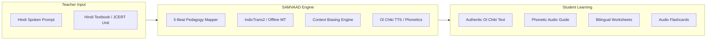

# 📚 SAMVAAD (संवाद) — Prototype Overview & Technical Architecture

This document provides a complete technical walkthrough of the **SAMVAAD** prototype developed for **Smart India Hackathon 2026** (Problem Statement ID: **SIH26042 — Smart Education**).

---

## 🎯 1. Prototype Objectives & Scope

SAMVAAD is designed as a **dual-screen, bilingual pedagogical companion** for Grade 1–2 primary classrooms in tribal districts of Jharkhand (e.g., Dumka, Santhal Pargana).

---

## 🏗️ 2. Core Modules in the Prototype

### 1. 📖 FLN Lesson Flow (पाठ योजना)
- **Pedagogical Stages**:
  - `Beat 1`: ध्यानाकर्षण (Attention Hook)
  - `Beat 2`: अवधारणा परिचय (Concept Introduction)
  - `Beat 3`: निर्देशित अभ्यास (Guided Practice)
  - `Beat 4`: स्वतंत्र कार्य (Independent Task)
  - `Beat 5`: समापन एवं गृहकार्य (Closure & Home Linkage)
- **Quality Verification Cycle**:
  - Units are marked with explicit state badges: `✓ Verified PALASH` or `⚠ Unreviewed Draft`.
  - Teachers and administrators can review auto-parsed workbook imports and mark them as verified.
- **Workbook Ingestion**:
  - Parses uploaded PDF/Text workbooks with line-by-line error handling so unparseable lines do not crash the document.

### 2. 🎙️ Live Voice Bridge (प्रत्यक्ष संवाद)
- **Bidirectional Speech-to-Speech Flow**:
  - `Hindi ➔ Santali`: Teacher speaks Hindi $\rightarrow$ App renders Hindi transcript + Ol Chiki $\rightarrow$ Audio synthesis plays Santali phonetics.
  - `Santali ➔ Hindi`: Student responds $\rightarrow$ App converts to Hindi translation with phonetics.
- **Curriculum Context Biasing**:
  - Biases MT output towards the active unit's vocabulary list, prioritizing classroom FLN terminology over general domain synonyms.
- **Telemetry Latency Monitor**:
  - Tracks round-trip latency across ASR, MT, and TTS against the target threshold of $<3.0\text{s}$.

### 3. 📝 Worksheets & Flashcards (अभ्यास पत्रक)
- **Bidirectional (Vice-Versa) Generator**:
  - Toggle between **Hindi $\rightarrow$ Santali** and **Santali $\rightarrow$ Hindi** modes.
  - Generates matched pairs (Column A vs Column B shuffled) and fill-in-the-blank questions with word banks.
- **True PDF Export**:
  - Produces formatted A4 PDF worksheets using `html2pdf.js` for classroom printing.
- **Audio-Enabled Flashcard Deck**:
  - Interactive flip cards with Ol Chiki Unicode, Romanized phonetics, and native audio synthesis.

### 4. 🔄 Teacher Feedback & CRC Sync Queue (सीआरसी कतार)
- **Offline Local Storage**:
  - All flagged mistranslations and dialect suggestions are saved locally in browser `localStorage`.
- **Cluster Resource Centre (CRC) Review**:
  - Coordinators can review items during school visits and trigger batch sync to central databases.
- **Export Capabilities**:
  - Single-click CSV and JSON export for administrative records.

---

## 📱 3. Mobile & Multi-Platform Readiness

1. **Responsive Mobile Web / PWA**:
   - Built with strict viewport clamping (`overflow-x: hidden; max-width: 100vw;`) to eliminate horizontal scroll issues.
   - Pinned, thumb-friendly **Mobile Bottom Navigation Bar** for one-handed operation in classrooms.
2. **Expo SDK 54 Companion App (`expo-app/`)**:
   - Configured with `react-native-webview` and platform fallbacks.
3. **Capacitor Android Project (`android/`)**:
   - Ready for building standalone Android APKs.

---

## 📂 4. Project File Overview

| Directory / File | Description |
| :--- | :--- |
| `src/components/Header.tsx` | Main navigation, offline toggle, and mobile bottom bar |
| `src/components/LessonTranslator/` | 5-beat pedagogy viewer, draft state management, and workbook uploader |
| `src/components/VoiceBridge/` | Live voice translation bridge, context biasing, and latency telemetry |
| `src/components/Worksheets/` | Worksheets, PDF generator, and audio flashcards |
| `src/components/Corrections/` | CRC feedback queue and offline sync |
| `src/data/` | Master FLN units, Ol Chiki vocabulary, and offline translation dictionaries |
| `src/services/` | Speech synthesis, translation routing, PDF export, and workbook parsing |
| `src/types/` | TypeScript interfaces for curriculum, translation, and CRC corrections |
| `expo-app/` | Expo SDK 54 mobile wrapper |
| `android/` | Capacitor native Android project files |
| `HANDOFF_AND_PROJECT_GUIDE.md` | Comprehensive onboarding guide for teammates |

---
*Created for Smart India Hackathon 2026.*
